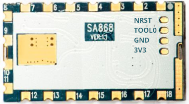
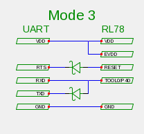

# Programming Guide

##  Flashing the SA868 RF Module

If using the SA868 OpenEdition, it is necessary to flash a firmware onto the onboard Renesas RL78 microcontroller. The requisite programming interface is exposed on the module as shown below.



> [!IMPORTANT] 
> The [rl78flash](https://github.com/msalau/rl78flash) command line serial programmer is required for these steps.

To flash the module, mode 3 is specified for the serial bootloader. a USB-TTY serial programming cable must then be fashioned to reflect the requisite hardware as shown below.




```bash
rl78flash -m 3 -a -v /dev/ttyUSB0 sa868s-v1.0-patched.s37
```

## Communicating with the SA868


### Factory SA868 communication protocol

#### UART Interface Configuration
* Baud rate = 9600 Baud
* Data bit = 8 bit
* Parity = None
* Stop bit = 1 bit
* Logic Levels = 0 V, 3.3 V

#### Instruction Transmission Format

* `AT+DMOCONNECT`
* `S+sweep_freq`
    - `[134:174]`.[mod 1250]: valid VHF frequency when BW = `0`
    - `[400:480]`.[mod 2500]: valid UHF frequency when BW = `1`
* `AT+DMOSETGROUP=bandwidth_wide_fm,tx_freq,rx_freq,tx_subaudio,squelch,rx_subaudio`
    - bandwidth_wide_fm `[0:1]`: `0` = 12.5kHz or `1` = 25kHz
    - tx_freq, rx_freq
        - `[134:174].[mod 1250]`: valid VHF frequency when BW = `0`
        - `[400:480].[mod 2500]`: valid UHF frequency when BW = `1`
    - tx_subaudio, rx_subaudio
        - `0000`: subaudio disabled 
        - `[0001:0038]`: CTCSS
        - `[023?:754?]`: CDCSS code (?=N indicates complement or ?=I)
    - squelch `[0:8]`: `0` = listen mode or `[1:8]` squelch
* `AT+DMOSETVOLUME=volume_level`
    - `[1:8]`: set configured volume level to X
* `AT+RSSI?`
* `AT+SETFILTER=emphasis,voice_highpass,voice_lowpass`
    - `0`: emphasis,voice_highpass,voice_lowpass normal
    - `1`: emphasis,voice_highpass,voice_lowpass bypass

#### Instruction Return Format:

* `+DMOCONNECT:0` -> Normal working status
* `S=X`
  - `S=0` -> The frequency to be scanned has a signal
  - `S=1` -> There is no signal to sweep the frequency
* `+DMOSETGROUP=X`
  - `+DMOSETGROUP:0` -> Successfully set working parameters
  - `+DMOSETGROUP:1` -> Data setting is out of range
* `DMOSETVOLUME=X`
  - `+DMOSETVOLUME:0` -> Successfully set volume level
  - `+DMOSETVOLUME:1` -> Failed volume level setup
* `RSSI:XXX` -> Current signal strength value from 0 to 255, unit 1dB
* `+DMOSETFILTER:X`
  - `+DMOSETFILTER:0` -> Successfully set module filter
  - `+DMOSETFILTER:1` -> Failed filter setup

